<div align="center">

# 🛒 GreenBasketry

### Full-stack online grocery store with secure payments and an admin dashboard


</div>

## 📖 About

GreenBasketry is a MERN-stack e-commerce app for buying groceries online. Customers browse products, fill a cart and pay with **Stripe** or **Cash on Delivery**. Store admins manage products and move orders through the fulfilment pipeline from a separate panel.

| App | Purpose | URL |
|---|---|---|
| 🛍️ Storefront | Customer shop (React, Vite, Tailwind) | `localhost:5173` |
| 🧑‍💼 Admin Panel | Products and orders (React, Vite, Tailwind) | `localhost:5174` |
| ⚙️ Backend API | Auth, payments, data (Node, Express, MongoDB) | `localhost:4000` |

## ✨ Features

**Customers**
- Sign up and log in (JWT auth, bcrypt-hashed passwords)
- Browse products by category: Fruits, Vegetables, Dairy, Beverages, Snacks, Seafood, Bakery, Meat
- Cart saved per user in the database
- Pay online with Stripe Checkout or choose Cash on Delivery
- Order history with live order and payment status
- Contact page with an enquiry form

**Admin**
- Add products with image upload, and delete them
- View all orders with customer details, items and totals
- Update order status: Pending → Processing → Shipped → Delivered (or Cancelled)
- Filter orders by status, with summary cards

**Engineering highlights**
- Prices and tax calculated **server-side**, so the client can't tamper with totals
- Stripe payments **verified on the server** before an order is marked Paid
- Protected API routes, restricted CORS, secrets kept in `.env`

## 📸 Screenshots

### 🛍️ Storefront
| Home | Contact |
|---|---|
| 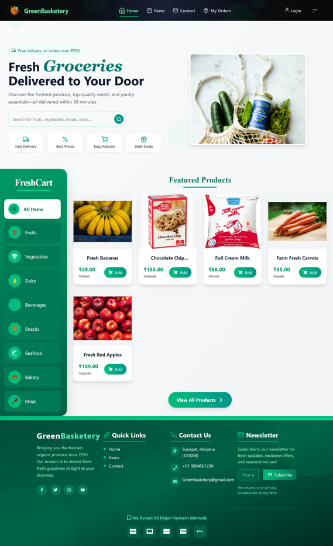 | 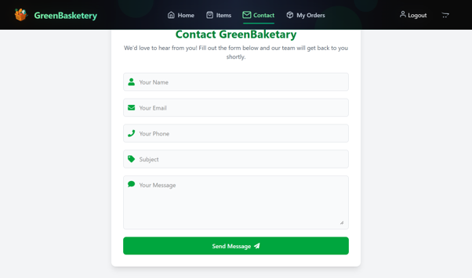 |

| Sign Up | Login |
|---|---|
| 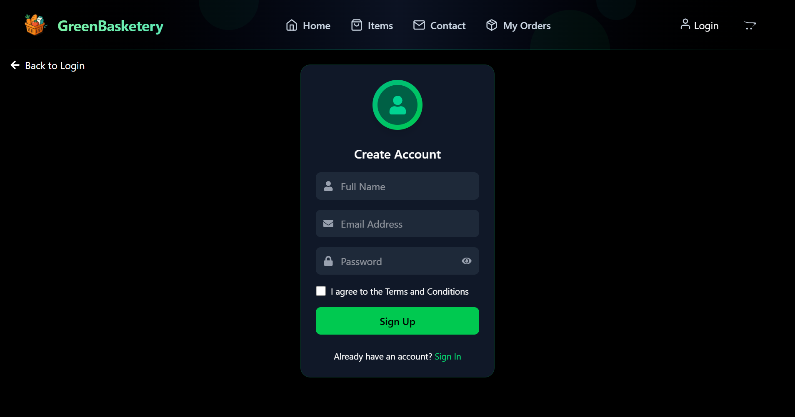 | 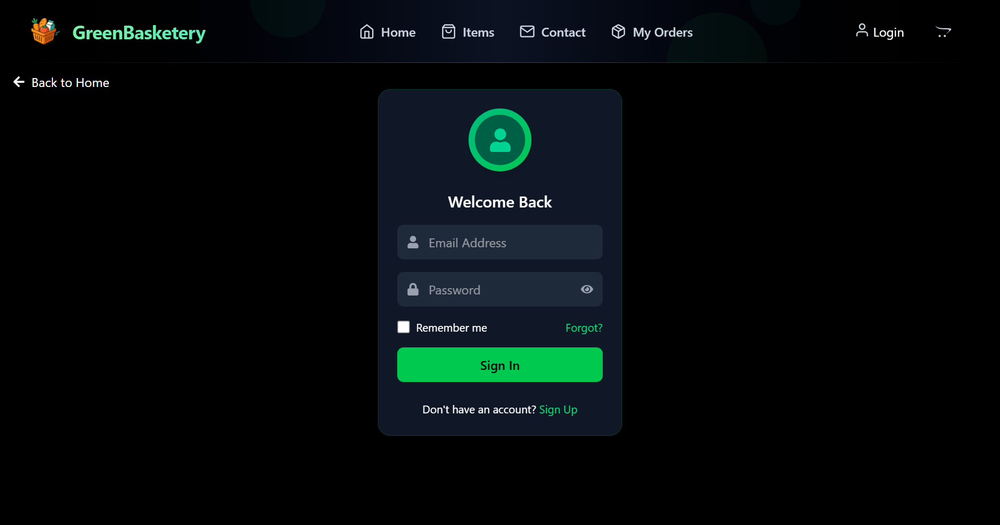 |

| Cart | Checkout | My Orders |
|---|---|---|
| 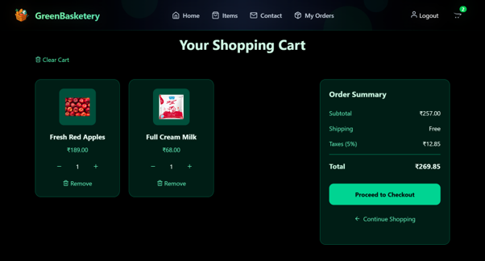 | 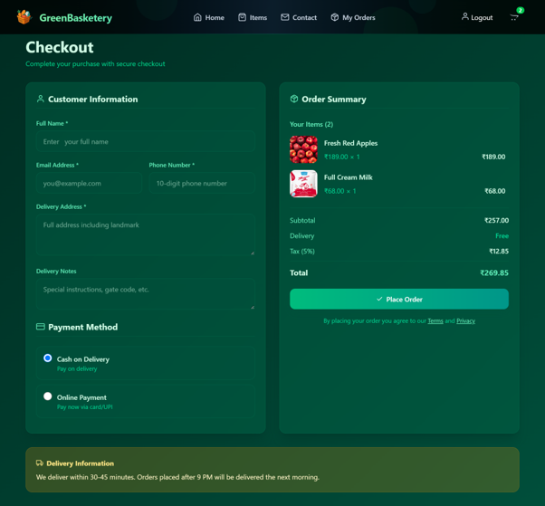 | 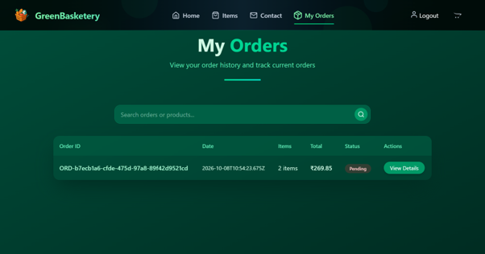 |

### 💳 Stripe Payment
| Stripe Checkout | Payment Success |
|---|---|
| 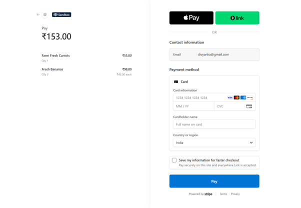 | 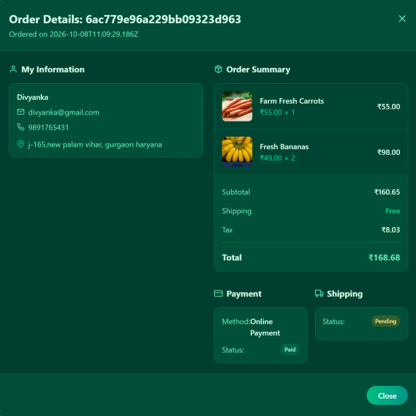 |

### 🧑‍💼 Admin Panel
| Add Product | Listed Items |
|---|---|
| 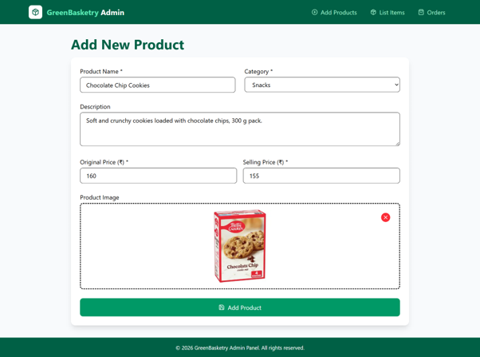 | 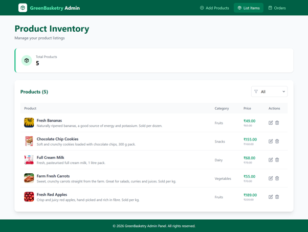 |

| Orders | Updating Order Status |
|---|---|
| 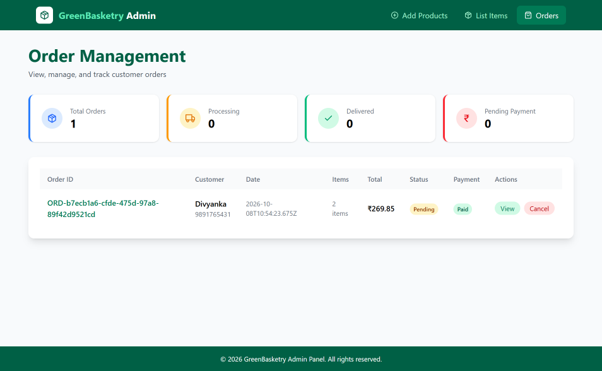 | 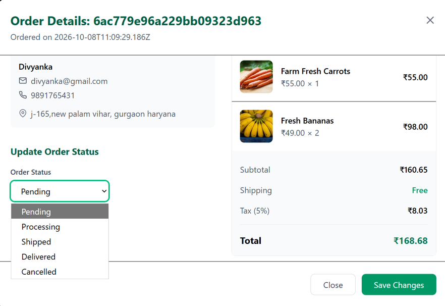 |

## 🧰 Tech Stack

- **Frontend and Admin:** React 19, Vite, Tailwind CSS 4, React Router, Axios
- **Backend:** Node.js, Express 5, Mongoose, JWT, bcrypt, Multer
- **Database:** MongoDB Atlas
- **Payments:** Stripe Checkout (test mode)

## 🚀 Getting Started

**Prerequisites:** [Node.js](https://nodejs.org/) LTS, a free [MongoDB Atlas](https://www.mongodb.com/atlas) cluster, a [Stripe](https://stripe.com/) account (test mode).

```bash
git clone https://github.com/NainaBhat/Greenbasketry.git
cd Greenbasketry
```

**1. Backend**
```bash
cd backend
npm install
```
Create an empty `uploads` folder inside `backend`, then add `backend/.env`:
```env
PORT=4000
MONGO_URI=your_mongodb_connection_string
JWT_SECRET=your_long_random_secret
STRIPE_SECRET_KEY=sk_test_your_stripe_key
FRONTEND_URL=http://localhost:5173
```
```bash
npm start
```

**2. Storefront** (new terminal)
```bash
cd frontend
npm install
npm run dev
```

**3. Admin panel** (new terminal, start after the storefront)
```bash
cd admin
npm install
npm run dev
```

Open `http://localhost:5173` (shop) and `http://localhost:5174` (admin). The database starts empty, so add a few products from the admin panel first.

**Test payment:** card `4242 4242 4242 4242`, any future expiry, any 3-digit CVC. No real money is charged.

## 🔌 API Overview

| Route | Purpose |
|---|---|
| `/api/user` | Register and login |
| `/api/items` | Product list, add, delete |
| `/api/cart` | Cart operations (JWT required) |
| `/api/orders` | Place orders, confirm Stripe payments, list and update orders |

## 🗺️ Roadmap
- Admin authentication and roles
- Product search and filters
- Stripe webhooks and email notifications
- Cloud deployment (Render and Vercel)

<div align="center">

**Maintained by Naina Bhat** · [GitHub](https://github.com/NainaBhat)

</div>
